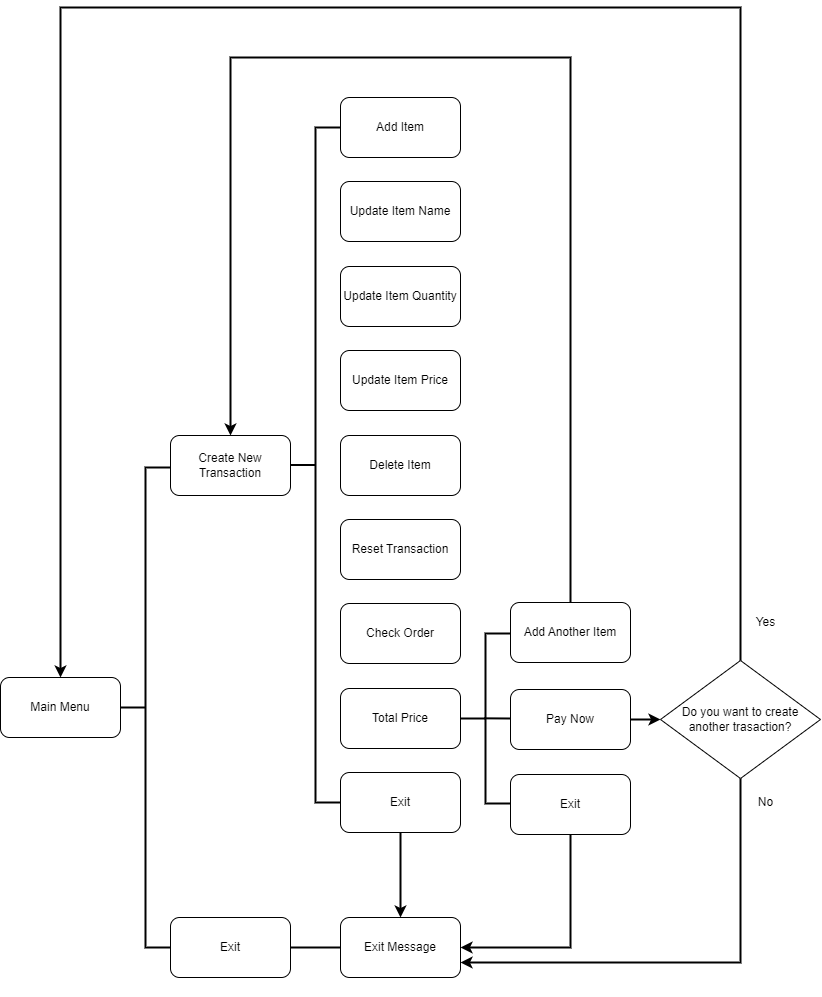

# Super-Cashier

### Background
A big supermarket in a city in Indonesia want to improve their business process. They want to create a self-service cashier so the customers can add item's name, quantiy, and price by themself. By this cashier system, they also hope that people who are out of town can buy goods from their supermarket.

### Requirement
- Create ID transaction using class object
- Add item's name, quantity, and price
- Update item's name, quantity, and price
- Delete item
- Reset transaction (delete all item)
- Check whether item's name, quantity, and price is correct or not
- Check total price after discount

### Flowchart


From the main menu, customer can create new transaction to start add item or exit to close the program. From transaction, customer can add item, update item's name, update item's quantity, update item's price, delete an item, delete all item, check whether the inputed value is correct or not, and check total price. After the customer check the total price, there will be options to pay the transaction now, add another item, or exit if they want to cancel the order. In the end after they choose pay now, user will be asked whether they want to create another transaction or not.   

### Code Explanation
This project has 2 scripts, main.py and transaction.py. Scripts of main.py is used for showing the cashier interface. While, scripts of transaction.py consist of some functions that are used for running the main.py script. Below are functions in transaction.py.

add_item : Add item's name, quantity, and price to item's dataframe.
```
def add_item(self, nama_item, jumlah_item, harga_item):
    '''
    Add item's name, quantity, and price to item's dataframe
    Parameters
    ----------
    nama_item : str 
        item's name
    jumlah_item : int 
        item's quantity
    harga_item : int 
        item's price
    Returns
    -------
    None 
    '''
    added_item = [nama_item, jumlah_item, harga_item]
    column_name =["Nama Item", "Jumlah Item", "Harga/Item"]
    self.df_item.loc[len(self.df_item.index),column_name] = added_item
```
update_item_name: Update specific item's name
```
def update_item_name(self, nama_item, update_nama_item):
    '''
    Update specific item's name
    Parameters
    ----------
    nama_item : str 
        item's name
    update_nama_item : str 
        updated item's name

    Returns
    -------
    None 
    '''
    match_item = self.df_item["Nama Item"].str.fullmatch(nama_item)
```
update_item_qty: Update item's quantity based on specific item's name
```
def update_item_qty(self, nama_item, update_jumlah_item):
    '''
    Update item's quantity based on specific item's name
    Parameters
    ----------
    nama_item : str 
        item's name
    update_jumlah_item : int
        updated item's quantity

    Returns
    -------
    None 
    '''
    match_item = self.df_item["Nama Item"].str.fullmatch(nama_item)
    self.df_item.loc[match_item, "Jumlah Item"] = update_jumlah_item
```
update_item_price: Update item's price based on specific item's name
```
 def update_item_price(self, nama_item, update_harga_item):
    '''
    Update item's price based on specific item's name
    Parameters
    ----------
    nama_item : str 
        item's name
    update_jumlah_item : int
        updated item's price

    Returns
    -------
    None 
    '''
    match_item = self.df_item["Nama Item"].str.fullmatch(nama_item)
    self.df_item.loc[match_item, "Harga/Item"] = update_harga_item
```
delete_item: Delete item based on specific item's name
```
 def delete_item(self, nama_item):
    '''
    Delete item based on specific item's name
    Parameters
    ----------
    nama_item : str 
        item's name

    Returns
    -------
    None 
    '''
    match_item = self.df_item["Nama Item"].str.fullmatch(nama_item)
    self.df_item = self.df_item[~match_item].reset_index(drop=True)
```
reset_transaction: Delete all item
```
def reset_transaction(self):
    '''
    Delete all item
    Parameters
    ----------
    None

    Returns
    -------
    None 
    '''
    self.df_item=self.df_item.head(0)
```
check_order_value: Check whether the value of items that have been inputed is correct or not
```
def check_order_value(self):
    '''
    Check whether the value of items that have been inputed is correct or not
    '''

    output = []


    if self.df_item.empty:
        output.append("No items added")
    else:
        if "" in self.df_item["Nama Item"].str.strip().values:
            output.append("Item's name can't be blank.")
        if 0 in self.df_item["Jumlah Item"].values:
            output.append("Item's quantity can't be 0.")
        if 0 in self.df_item["Harga/Item"].values:
            output.append("Item's price can't be 0.")

    if output == []:
        output = ["Transaction data is correct."]

    return output
```
check_order: Check whether the value of items that have been inputed is correct or not and show the transaction data
```
def check_order(self):
    '''
    Check whether the value of items that have been inputed is correct or not
    and show the transaction data
    '''

    output = self.check_order_value()

    if output==["Transaction data is correct."]:
        self.df_item["Total Harga"]= self.df_item["Jumlah Item"] * self.df_item["Harga/Item"]

    print("\n".join(output))
    print(tabulate(self.df_item, headers="keys", tablefmt="grid"))
```
total_price: Calculate subtotal, discount, and total amount to be paid
```
def check_order(self):
    '''
    Check whether the value of items that have been inputed is correct or not
    and show the transaction data
    '''

    output = self.check_order_value()

    if output==["Transaction data is correct."]:
        self.df_item["Total Harga"]= self.df_item["Jumlah Item"] * self.df_item["Harga/Item"]

    print("\n".join(output))
    print(tabulate(self.df_item, headers="keys", tablefmt="grid"))
```

### Test Case
- Test Case 1 : Add Item

    
- Test Case 2 : Delete Item

    
- Test Case 3 : Reset Transaction

    
- Test Case 4 : Check Total Price

    
    
### Conclusion/Future Work
This Super Cashier project has created a program that can help the customers to do the transaction by themself. However, ideally, it's better if there is an item database that can show available products and the prices instead of letting the customers to add the item price by themself.
